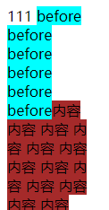

学习笔记
## 跳过点
1. dtd

### HTML的三种namespace
+ www.w3.org/1999/xhtml
+ svg
+ MathML
### 标题表示
```
<hgroup>
 <h1>标题</h1>
 <h2>对标题的解释</h2>
</hgroup>

```
### 浏览器API
#### traversal 不好用，废弃
#### 节点分类
+ Node
+ + Element 元素型节点 ⭐
+ + + HTMLElement
+ + + + HTML**Anchor**Element [a标签] [**命名特殊**]
+ + + + HTML**Body**Element [body]
+ + + SVGElement 
+ + + + SVG**A**Element 同[body]命名方式
+ + + + SVG**Alt**GlyphElement
+ + Document 文档根节点
+ + CharacterDate 字符数据
+ + + Text 文本节点
+ + + + CDATASection:CDATA节点
+ + + Comment 注释
+ + + ProcessingInstruction 处理信息 [不常用] [预处理]
+ + DocumentFragment 文档片段
+ + DocumentType 文档类型
##### 修改操作
+ removeChild 父元素操作
+ replaceChild
+ insertBefore 相当于将元素**剪切**到另一个元素之前
+ appendChild 向节点添加最后一个子节点 [如果添加的元素为**页面中**的，有剪切效果] [如果父元素通过createElement创建出来的,且**没放入DOM树中**,仍有剪切效果]
#### 导航类操作
+ parentNode
+ parentElement
+ childNodes
+ childrent
+ firstChild
+ firstElementChild
+ lastChild
+ lastElementChild
+ nextSibling
+ nextElementSibling
+ previousSibling
+ previousElementSibling
###### 高级操作
+ compareDocumentPosition 比较两个节点中关系的函数
+ 检查一个节点是否包含另一个节点函数
+ isEqualNode 检查两个节点是否完全相同
+ isSameNode 检查两个节点是否是同一个节点，实际上子js中可以用===
+ cloneNode 复制一个节点,如果传入参数true,则子元素也一起被拷贝
+ appendChild 如果元素本身在dom中则有剪切效果
#### 事件
##### addeventLisenter 第三个参数
+ true/false 是否开启捕获
+ option 有三个参数{capture:是否开启捕获,once:事件只执行一次，passive:？？⭐}
##### 当元素作注册捕获事件和冒泡事件且是目标元素时，谁先注册谁优先执行
#### Range API 性能好，做浏览器需要

## Range
### 创建方法
+ 第一种
```
var range=new Range()
range.setStart(element,9)
range.setEnd(element,4)
```
+ 第二种
```
var range=document.getSelection().getRangeAt(0)
```
### 把range的内容从DOM中取出来 【**删除**】
```
//返回一个DocumentFragment对象:文档片段,被append时，自身的子节点会被添加到DOm上，自身不会被添加到DOM上，**也有querySelector()/querySelectorAll()**
var fragment=range.extractContents)()
```
### range中新插入一个节点 【**添加**】
```
range.insertNode(document.createTextNode('aaa'))
```
### range常用方法
+ setStart(节点，第几个)
+ + setStart(document.getElementById('a').childNodes[0],3) 元素a的第0个子节点的第三个字符【如果子节点为元素】
+ + setEnd(document.getElementById('a').childNodes[0],3)
```
let box=document.getElementById('box')
let range=new Range()
range.setStart(box.children[0].childNodes[0],2) //1.childNodes子节点，包含空白节点 [**包括回车**]，2.children子元素
range.setEnd(box.children[1].childNodes[0],1)   
```
## cssom
### Data URLs 格式data:[<mediatype>][;base64],<data>
+ <link rel='stylesheet' title='x' href='data:text/css,p%7Bcolor:blue%7D'> 相当于 p{color:blue}
+  
###  Rule种类 document.styleSheets[i].cssRules
+ CSS**Style**Rule
+ CSS**Charset**Rule
+ CSS**Import**Rule
+ CSS**Media**Rule
+ CSS**FontFace**Rule
+ CSS**Page**Rule
+ 。。。。。
### 获取某个元素渲染到页面上的CSS属性
+ window.getComputedStyle(document.querySelector('#box'),【'::after'】)
### window
+ window.innerHeight/innerWidth **视口**viewport的宽度 **包括滚动条**
+ window.outerWidth/outerHeight
+ window.devicePixelRatio DPR 物理像素分辨率/CSS像素分辨率
+ window.screen
### 控制通过windwo.open打开的浏览器窗口 
```
var w=window.open(url,'_blank','width=100,height=100,left=100,right=100')
```
+ 当第三个参数不为空时，可使用w.moveTo(x,y)/moveBy(x,y)/resizeTo(x,y)/resizeBy(x,y) 改变窗口位置和大小
### scroll
#### 元素scroll
+ scrollTop
+ scrollLeft
+ scrollWidth
+ scrollHeight
+ scroll(x,y)   相对盒子左上角位置滚动到多少
+ scrollBy(x,y) 相对**当前位置**滚动到多少
+ scrollInteoView() 元素滚动到可视区
#### window scroll
+ scrollX == scrollTop
+ scrollY == scrollLeft
+ scroll(x,y)
+ scrollBy(x,y)
### layout
#### element.getClientRects()/getBoundingClientRect()
+ getClientRects() 返回元素里面的所有盒子
+ getBoundingClientRect() 返回一个包裹了当前元素盒子
```
#box{
        width: 100px;
    }
span{
        background-color: brown;
    }
span::before{
        content: 'before before before before before before';
        background-color: aqua;
}
<div id="box">
    111
    <span id='span'>内容 内容 内容 内容 内容 内容 内容 内容 内容 内容 内容 内容 内容</span>
</div>
```
```
let box = document.getElementById('span')
```
+ 结果
--------------
  
+ **box.getClientRects()**
+ + DOMRectList {0: DOMRect, 1: DOMRect, 2: DOMRect, 3: DOMRect, 4: DOMRect, 5: DOMRect, 6: DOMRect, 7: DOMRect, 8: DOMRect, 9: DOMRect, 10: DOMRect, length: 11}
+ **box.getBoundingClientRect()**
+ + DOMRect {x: 8, y: 8, width: 89.46875, height: 231, top: 8, …}
--------------
## 标准化组织
> khronos
> > WebGL
> ECMA
> >ECMAScript
> WHATWG [网站总是最新版]
> > HTML
> W3C
> > webaudio
> > CG(社区组织)/WG职业工作组织

+ Object.getOwnPropertyNames(obj) 返回对象的所有自身属性的属性名（包括不可枚举属性[不能通过for...of]取到的，但不包括Symbol值作为名称的属性）组成的数组。
## a.__proto__ a为函数时 用此方法判断加instanceof不能判断类型
